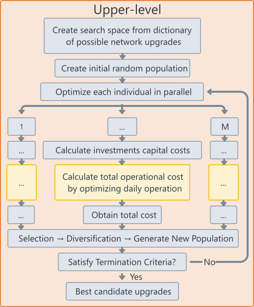
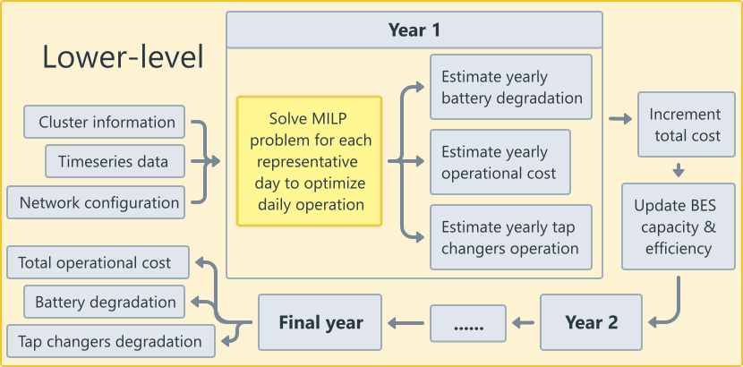

# GridOptiPlan

The overall framework of the project is explained in the following image:  


The pre-processing part is done locally. Then the optimization stage can also run locally or in a remote machine. This option can be controlled from the configuration file.

The Upper-level consists of a Genetic-Algorithm(GA) which will decide the final network investments. The GA runs for multiple generations. In each generation, there are N candidate individuals that should be evaluated. Those individuals are distributed to as many workers or threads possible in order to run in parallel. To implement the Genetic Algorithm for the Upper-level, the Metaheuristics.jl package of Julia is used. A more detailed representation of the upper-level optimization process is shown below:  


Focusing on only one individual, the target is to calculate the capital costs of the network investments and the operational costs for a period of 15 years. The first one is more straightforward. For the operational costs, a MILP optimization sub-process is used. This sub-process is executed many times for each individual. The target is to optimize the operational costs for a single day. For each of the 15 years, a few representative days have been selected in order to evaluate their operational costs and deduct an estimate of the overall operational costs for the 15-year period. A more detailed diagram of the upper and lower levels, showcasing each individual and the respective sub-processes is shown below:  


In order install the environment for executing the optimization, run the following commands.  
```
julia> using Pkg  
      Pkg.activate(".")  
      Pkg.instantiate()
```

A representative example of how to run the entire process can be found in the following directory:
`src/example.jl`