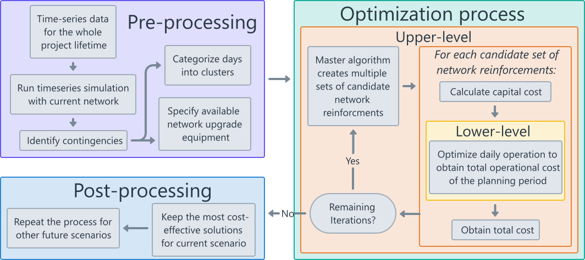
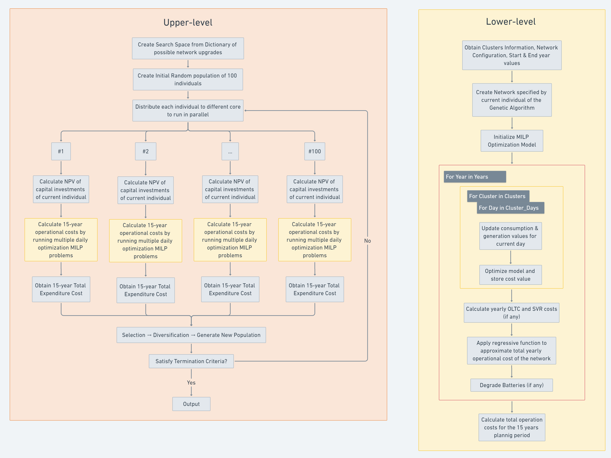

# GridOptiPlan

The overall framework of my project is explained in the following image:

The pre-processing part is done locally. Then the data should be uploaded to the remote machine. The Upper-level consists of a Genetic-Algorithm(GA) which will decide the final network investments. The GA runs for multiple generations. In each generation, there are 100 candidate individuals that should be evaluated. Those individuals are distributed to as many workers or threads possible in order to run in parallel. 

Focusing on only one individual, the target is to calculate the capital costs of the network investments and the operational costs for a period of 15 years. The first one is more straightforward. For the operational costs, a MILP optimization sub-process is used. This sub-process is executed many times for each individual. The target is to optimize the operational costs for a single day. For each of the 15 years, a few representative days have been selected in order to evaluate their operational costs and deduct an estimate of the overall operational costs for the 15-year period.

The MILP optimization subprocess needs 200-300 MB of disk space in order to run effectively. Considering that in total there are 100 individuals running in parallel, each one having a separate sub-process, the memory requirements would be at least around 32 GB of memory space.
A more detailed diagram of the upper and lower levels, showcasing each individual and the respective sub-processes is shown below:

To implement my Genetic Algorithm for the Upper-level, I am using the Metaheuristics.jl package of Julia.

Currently, in the docs there is the possibility to parallelize the process by running the subprocesses in different threads as following:  
julia> function f_parallel(X)  
      fitness = zeros(size(X,1))  
      Threads.@threads for i in 1:size(X,1)  
        fitness[i] = f(X[i,:])  
      end  
      fitness  
    end  

julia> options = Options(iterations=10, parallel_evaluation=true);

julia> optimize(f_parallel, [-10ones(5) 10ones(5)], ECA(;options))

However, there isn't any implementation yet to run each individual of the current generation of the GA in separate machines with separate memories.

Each subprocess is actually a MILP optimization problem, for given network characteristics that are provided by the genetic algorithm on the Upper Level. The MILP problem optimizes the daily operational costs for the network. To alleviate the computational burden, the operational cost is approximated by running a few representative days for each year of the planning period. Thus the daily optimization problem in the lower lever runs not once, but multiple times to obtain the costs for the specified days.
